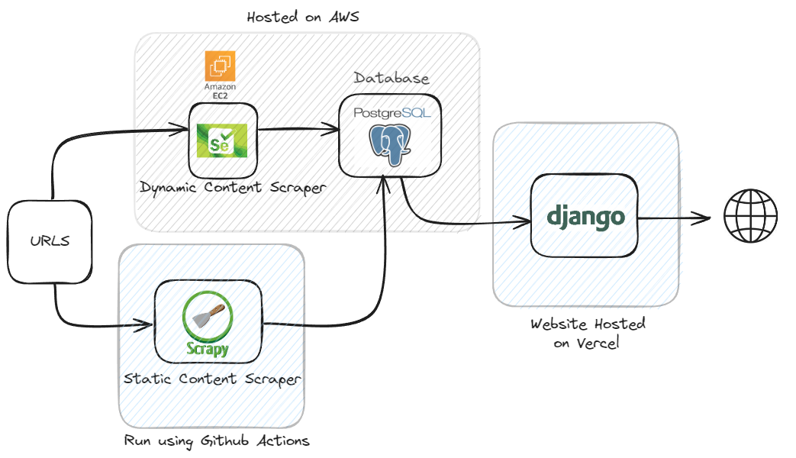

## Postings Parser - 
 I created this project to get relevant job postings as soon as they are posted. I found Linkedin to be pretty bad for finding relevant job postings
 
 I also heard that it takes time from job being posted on company website for it to show up on Linkedin (not sure if it is true) so I wanted to see if I can get it before that and apply to maximize my chances of getting an interview in this job market


## Design and Workflow -
 
 - **Goals** :
	- Keeping the cost as low as possible (ideally zero). Therefore, I made several tradeoffs and design choices to achieve this. They are explained below
	- Not get IP banned. This is always the fear with scraping so I did not run the scrapers locally instead made use of Github Actions and EC2 to run them

 - **Steps** :-
	- **Getting URLS** : I used CommonCrawl corpus to search for urls with the domain and pattern I wanted using Athena. I have around 3000 URLS which I scrape twice daily. I have written a article on how to do it [Article](https://medium.com/@vtbs55596/how-to-query-common-crawl-data-using-amazon-athena-416ad13e54f8)
	- **Parsing Data** : I used different parsers for dynamic and static content. Scrapy for static content which loads without JS and selenium for dynamic content which loads with JS
		- **Static Scrapers** : I am using Scrapy for this and running them using Github Actions as we get 1000 hours of workflows free every month. These are ran twice daily
		- **Dynamic** : Using Selenium for this and running them on ec2 since they require headless chrome to run and are pretty slow comapred to scrapy. I am starting a bunch of ec2 instances using Terraform then downloading and running the docker image using Ansible. After everything is done, then terminating ec2 instances. This is done twice daily using cron
	- **Data Storage** : The data is hosted on Neon which is wrapper around AWS RDS and has a free tier with 500MB of storage
	- **Web** : Used Django for this and hosted on Vercel since it has a free tier and they also give vercel.app website address


## Installation and Getting started -
 - **Minimum Requirements** :
	- `Python`
	- `Selenium`
	- `Scrapy`
	- `Postgres` 
 - **Additional Requirements**: (This includes requirements for infra parts)
	- `Docker`
	- `Ansible`
	- `Terraform`
	- `AWS account`
 - **Minimum Install with Docker**:
	- These steps are for ubuntu. They might differ for other scenarios
 	```
	./install.sh
	
 	```


## Future -
 - They are tons of things to do but I am not sure how I will proceed
 - Currently it scrapes only workday and lever sites. There is potential to add a lot more 
 - Optimize Terraform and Ansible scripts. Maybe I can use lambda instead of ec2
 - Improve frontend. I barely know any frontend and am using Django templates for it. This can be made pretty in some JS framework

### TODO -
 [] add linter
 [] add pre-commit hooks
 [] add static checker
